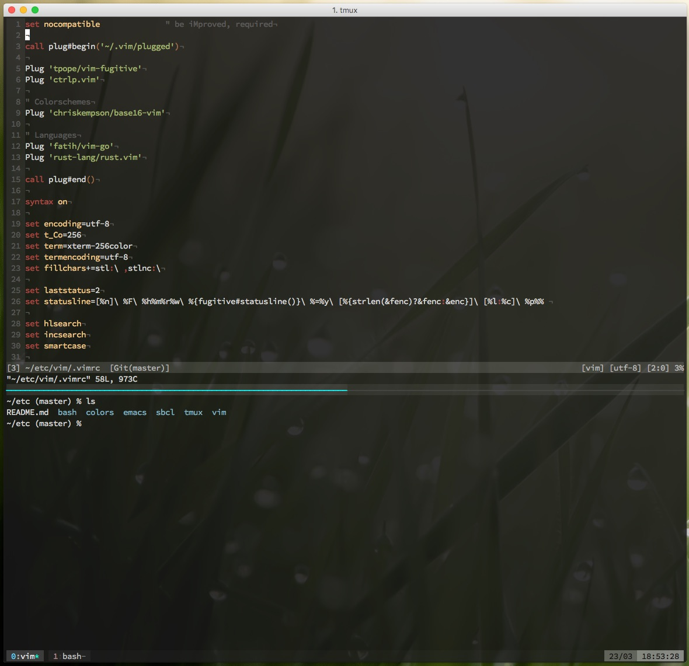

Personal config
===

Screenshot:


Requirements
---
TODO

Installation
---
With [GNU Stow](https://www.gnu.org/software/stow/):
```shell
stow bash
stow colors
stow emacs
stow sbcl
stow tmux
stow vim
```

